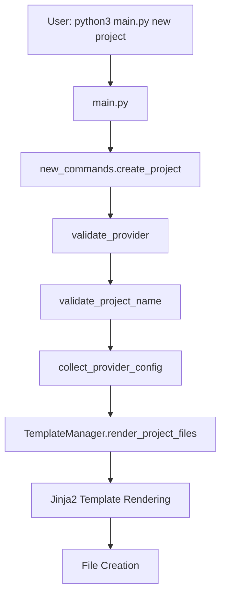
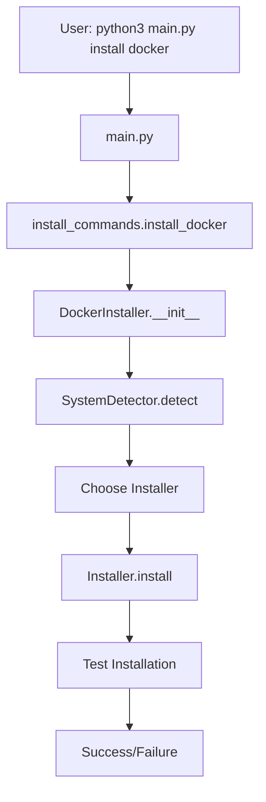

# 🔧 Documentação Técnica - CLI Terraform & Docker

## 🏗 Arquitetura do Sistema

### Estrutura de Diretórios

```
projeto_cli/
├── main.py                 # Entry point principal
├── src/                    # Código fonte modularizado
│   ├── commands/           # Implementação dos comandos CLI
│   │   ├── new_commands.py        # Comandos 'new'
│   │   ├── delete_commands.py     # Comando 'delete'
│   │   ├── terraform_commands.py  # Comandos 'run'
│   │   └── install_commands.py    # Comandos 'install'
│   ├── config/             # Configurações e constantes
│   │   ├── constants.py           # Enums e constantes
│   │   └── validation.py          # Validações e exceções
│   ├── templates/          # Gerenciamento de templates
│   │   └── template_manager.py    # Motor de templates Jinja2
│   ├── terraform/          # Integração com Terraform
│   │   └── terraform_runner.py    # Executor de comandos
│   └── system/             # Detecção e instalação
│       ├── system_detector.py     # Detecção de SO
│       ├── docker_installer.py    # Gerenciador principal
│       └── installers/            # Instaladores específicos
│           ├── base_installer.py      # Classe base
│           ├── ubuntu_installer.py    # Ubuntu/Debian
│           ├── macos_installer.py     # macOS
│           └── redhat_installer.py    # CentOS/RHEL/Fedora
└── templates/              # Templates Jinja2
    ├── common/
    │   └── gitignore.j2
    └── providers/
        ├── aws/
        │   ├── aws_provider.tf.j2
        │   └── s3_backend.tf.j2
        └── azure/
            ├── project/
            │   ├── main.tf.j2
            │   ├── variables.tf.j2
            │   ├── outputs.tf.j2
            │   ├── provider.tf.j2
            │   └── azurerm_backend.tf.j2
            └── resource/
                ├── storage-account/
                │   ├── main.tf.j2
                │   ├── variables.tf.j2
                │   └── outputs.tf.j2
                └── virtual_machine/
                    ├── main.tf.j2
                    ├── variables.tf.j2
                    └── outputs.tf.j2
```

## 🎯 Fluxo de Dados

### 1. Comando `new project`



### 2. Comando `install docker`



## 🔍 Detecção de Sistema

### Algoritmo de Detecção

```python
def detect() -> SystemInfo:
    # 1. Detectar arquitetura
    arch = _detect_architecture()  # x86_64, arm64
    
    # 2. Detectar WSL
    is_wsl = _is_wsl()  # Verificar /proc/version
    
    # 3. Detectar SO base
    system = platform.system()  # Linux, Darwin, Windows
    
    # 4. Para Linux: detectar distribuição
    if system == "linux":
        distro = _detect_linux_distro()  # Ubuntu, Debian, CentOS...
    
    # 5. Retornar SystemInfo completo
    return SystemInfo(os_type, arch, is_wsl, version)
```

### Detecção de WSL

```python
def _is_wsl() -> bool:
    try:
        with open("/proc/version", "r") as f:
            content = f.read().lower()
            return "microsoft" in content or "wsl" in content
    except:
        return False
```

### Detecção de Distribuição Linux

```python
def _get_distro_info() -> Dict[str, str]:
    # 1. Tentar /etc/os-release (padrão moderno)
    # 2. Fallback para /etc/lsb-release (Ubuntu/Debian)
    # 3. Fallback para uname -a (último recurso)
```

## 🐳 Sistema de Instalação Docker

### Arquitetura Modular

```python
class BaseInstaller(ABC):
    @abstractmethod
    def install(self) -> bool: pass
    
    @abstractmethod
    def uninstall(self) -> bool: pass
    
    @abstractmethod
    def get_install_commands(self) -> List[str]: pass
```

### Instaladores Específicos

#### Ubuntu/Debian
```python
class UbuntuInstaller(BaseInstaller):
    def install(self):
        # 1. apt update
        # 2. Instalar dependências
        # 3. Adicionar GPG key Docker
        # 4. Adicionar repositório Docker
        # 5. apt install docker-ce
        # 6. Configurar usuário/serviço
```

#### macOS
```python
class MacOSInstaller(BaseInstaller):
    def install(self):
        # 1. Verificar/instalar Homebrew
        # 2. brew install --cask docker
        # 3. Instruções Docker Desktop
```

#### CentOS/RHEL/Fedora
```python
class RedHatInstaller(BaseInstaller):
    def install(self):
        # 1. yum/dnf remove versões antigas
        # 2. Instalar yum-utils/dnf-plugins-core
        # 3. Adicionar repositório Docker
        # 4. yum/dnf install docker-ce
        # 5. systemctl enable/start docker
```

## 📄 Sistema de Templates

### Motor Jinja2

```python
class TemplateManager:
    def __init__(self):
        self.jinja_env = Environment(
            loader=FileSystemLoader(TEMPLATES_PATH),
            trim_blocks=True
        )
    
    def render_project_files(self, provider, data, path):
        # 1. Mapear templates por provider
        # 2. Renderizar cada template
        # 3. Escrever arquivos no destino
```

### Variáveis de Template

#### Projeto Azure
```python
template_data = {
    "project_name": "meu-projeto",
    "resource_group_name": "rg-backend",
    "storage_account_name": "sabackend",
    "container_name": "tfstate"
}
```

#### Recurso Storage Account
```python
template_data = {
    "resource_name": "minha-storage",
    "location": "East US",
    "location_short": "eus"
}
```

### Exemplo de Template

```hcl
# {{ project_name }} - Projeto Terraform para Azure

resource "azurerm_resource_group" "main" {
  name     = "rg-{{ project_name }}-main"
  location = var.location
  tags     = var.common_tags
}
```

## ⚡ Integração com Terraform

### Executor de Comandos

```python
class TerraformRunner:
    def run_command(self, action, project_path, extra_args=None):
        # 1. Validar se terraform existe
        # 2. Validar diretório do projeto
        # 3. Construir comando
        # 4. Executar com subprocess.Popen
        # 5. Capturar output em tempo real
        # 6. Retornar código de saída
```

### Output em Tempo Real

```python
process = subprocess.Popen(
    command,
    cwd=project_path,
    stdout=subprocess.PIPE,
    stderr=subprocess.STDOUT,
    text=True
)

for line in iter(process.stdout.readline, ''):
    print(line.rstrip())
```

## 🔐 Sistema de Validação

### Hierarquia de Validações

```python
# 1. Validações básicas
validate_project_name(name)
validate_provider(provider)

# 2. Validações de sistema
validate_terraform_installed()
validate_directory_exists(path)

# 3. Validações de templates
validate_template_exists(template_path, jinja_env)
validate_required_templates(provider)

# 4. Validações de dados
validate_template_variables(data, required_vars)
```

### Exceções Customizadas

```python
class ValidationError(Exception):
    """Exceção para erros de validação."""
    pass

# Uso em comandos:
try:
    validate_provider(provider)
except ValidationError as e:
    print(f"❌ Erro: {e}")
    raise typer.Exit(code=1)
```

## 🎨 Sistema de UI/UX

### Rich Console

```python
from rich import print

# Cores e emojis
print("🚧 Criando projeto...")
print("  [green]✓[/green] Arquivo criado")
print("  [red]✗[/red] Erro encontrado")
print("  [yellow]![/yellow] Aviso importante")
```

### Progress Indicators

```python
print("  [blue]1/6[/blue] Atualizando repositórios...")
print("  [blue]2/6[/blue] Instalando dependências...")
# ...
```

### Typer CLI Framework

```python
@app.command("install")
def install_command(
    tool: str = typer.Argument(...),
    check_only: bool = typer.Option(False, "--check-only"),
    force: bool = typer.Option(False, "--force", "-f")
):
    """Comando com argumentos e opções."""
```

## 🧪 Sistema de Testes

### Validação de Docker

```python
def test_docker_installation(self) -> bool:
    try:
        # 1. Testar 'docker version'
        result = subprocess.run(["docker", "version"], ...)
        
        # 2. Testar container 'hello-world'
        result = subprocess.run(["docker", "run", "--rm", "hello-world"], ...)
        
        return result.returncode == 0
    except Exception:
        return False
```

### Validação de Templates

```python
def validate_all_templates(self, provider, resource_type=None):
    missing = []
    
    # Templates de projeto
    for template in project_templates:
        if not self.jinja_env.get_template(template):
            missing.append(template)
    
    return missing
```

## 🔧 Configurações e Constantes

### Enums Principais

```python
class OperatingSystem(str, Enum):
    UBUNTU = "ubuntu"
    MACOS = "macos"
    WSL_UBUNTU = "wsl_ubuntu"
    # ...

class Provider(str, Enum):
    AWS = "aws"
    AZURE = "azure"

class TerraformAction(str, Enum):
    INIT = "init"
    PLAN = "plan"
    APPLY = "apply"
    # ...
```

### Mapeamentos de Configuração

```python
PROVIDER_TEMPLATES = {
    Provider.AWS: {
        "backend": "s3_backend.tf.j2",
        "provider": "aws_provider.tf.j2"
    },
    Provider.AZURE: {
        "backend": "azurerm_backend.tf.j2", 
        "provider": "provider.tf.j2"
    }
}

DEFAULT_CONFIG = {
    "aws": {"region": "us-east-1"},
    "azure": {
        "location": "East US",
        "location_short": "eus",
        "container": "tfstate"
    }
}
```

## 🚨 Tratamento de Erros

### Estratégia de Error Handling

```python
try:
    # Operação principal
    success = installer.install()
except ValidationError as e:
    # Erro de validação (input inválido)
    print(f"❌ Erro: {e}")
    raise typer.Exit(code=1)
except subprocess.CalledProcessError as e:
    # Erro de comando externo
    print(f"❌ Comando falhou: {e}")
    return False
except Exception as e:
    # Erro inesperado
    print(f"❌ Erro inesperado: {e}")
    raise typer.Exit(code=1)
```

### Timeouts e Limits

```python
# Timeout para comandos externos
result = subprocess.run(
    command,
    timeout=300,  # 5 minutos
    capture_output=True
)

# Timeout para testes Docker
result = subprocess.run(
    ["docker", "run", "--rm", "hello-world"],
    timeout=60  # 1 minuto
)
```

## 📊 Logging e Debug

### Output Estruturado

```python
def _run_command(self, command, shell=False, ignore_errors=False):
    try:
        result = subprocess.run(
            command,
            check=not ignore_errors,
            capture_output=True,
            text=True,
            timeout=300
        )
        return result
    except subprocess.TimeoutExpired:
        raise Exception(f"Comando timeout: {' '.join(command)}")
```

### Debug Information

```python
# Sistema
python3 main.py system-info
# Output: OS, arquitetura, WSL, versão, gerenciador de pacotes

# Status ferramentas
python3 main.py status
# Output: Docker instalado, versão, funcionando

# Templates disponíveis
# Verificação automática durante criação de projetos
```

---

## 🔗 Dependências Externas

### Python Packages
- `typer`: Framework CLI
- `rich`: Terminal formatting e cores
- `jinja2`: Template engine

### Ferramentas Externas
- `docker`: Containerização
- `terraform`: Infrastructure as Code
- Package managers: `apt`, `yum`, `dnf`, `brew`

### APIs e Repositories
- Docker Official Repository
- Terraform HashiCorp Repository
- Homebrew (macOS)

## 📈 Performance

### Otimizações Implementadas
1. **Detecção rápida de sistema**: Cache de resultados
2. **Templates pré-compilados**: Jinja2 loader otimizado
3. **Comandos paralelos**: Subprocess com timeout
4. **Validação antecipada**: Fail-fast nos erros

### Métricas Típicas
- Detecção de sistema: ~100ms
- Criação de projeto: ~500ms
- Instalação Docker Ubuntu: ~2-5min
- Instalação Docker macOS: ~1-3min

**🎯 Esta arquitetura garante modularidade, extensibilidade e facilidade de manutenção!**